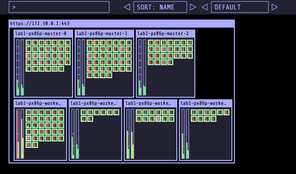

Want to know how full your cluster is? Or get a vague idea of what is running where? `kube-ops-view` is a simple dashboard that lets you visualize this.



```bash
git clone https://github.com/hjacobs/kube-ops-view.git
cd kube-ops-view/

oc new-project ops-view

oc adm policy add-scc-to-user privileged system:serviceaccount:ops-view:kube-ops-view
oc adm policy add-scc-to-user privileged system:serviceaccount:ops-view:default

sed -i 's|namespace: default|namespace: ops-view|g' deploy/rbac.yaml

oc create -f deploy/rbac.yaml
oc create -f deploy/deployment.yaml
oc create -f deploy/service.yaml
oc create -f deploy/redis-deployment.yaml
oc create -f deploy/redis-service.yaml

oc create route edge --service=kube-ops-view

oc get route -o custom-columns="kube-ops-view URL:.spec.host"
```
